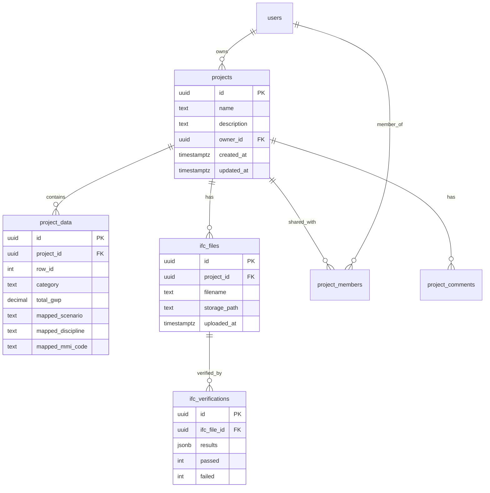

# Supabase Integration Research & Architecture Plan

**Date:** 2025-11-04
**Status:** Research Complete - Ready for Implementation Planning
**Author:** Claude Code

---

## Executive Summary

Complete analysis of current state management in the LCA Scenario Mapping app and comprehensive plan for Supabase integration. The app currently uses Streamlit's session_state for ephemeral data storage with no persistence between sessions. Supabase integration will enable project workspaces, mapping reuse, IFC verification history, and collaboration features.

**Key Finding:** Current architecture is well-suited for Supabase integration without major breaking changes. Session state can remain for ephemeral UI state while Supabase handles persistence.

---

## 1. Current State Management Analysis

### 1.1 Session State Usage

**Primary Data Store: `st.session_state`**

All pages access and modify session state directly:

```python
# Core session state variables (from main.py)
st.session_state['df']           # Main DataFrame with all data
st.session_state['auto_refresh']  # UI toggle for auto-refresh
```

**DataFrame Schema (`df`):**
```python
{
    # Original columns from Excel
    'category': str,                    # Raw category text
    'construction_a': float,            # LCA Phase A (Construction)
    'operation_b': float,               # LCA Phase B (Operation)
    'end_of_life_c': float,            # LCA Phase C (End-of-life)
    'total_gwp': float,                 # Calculated total
    
    # Auto-detection results (suggestions)
    'suggested_scenario': str,          # AI-detected scenario (A/B/C/D)
    'suggested_discipline': str,        # AI-detected discipline (RIV/ARK/etc)
    'suggested_mmi_code': str,         # AI-detected MMI code
    'suggested_mmi_label': str,        # MMI description
    
    # User mappings (ground truth)
    'mapped_scenario': str,             # User-confirmed/edited scenario
    'mapped_discipline': str,           # User-confirmed/edited discipline
    'mapped_mmi_code': str,            # User-confirmed/edited MMI
    
    # Metadata
    'is_summary': bool,                 # Auto-detected summary row
    'excluded': bool,                   # User/auto exclusion
    'row_id': int                       # Tracking ID (0-based)
}
```

### 1.2 Data Flow Pattern

**Upload Flow:**
```
1. User uploads Excel file (main.py)
   └─> load_excel_file(file_buffer)
       ├─> Parse Excel columns
       ├─> Run auto-detection (detector.py)
       ├─> Populate suggested_* columns
       ├─> Initialize mapped_* = suggested_*
       └─> Store in st.session_state['df']

2. User navigates to pages
   └─> All pages read st.session_state['df']
   └─> Pages modify df in place
   └─> Changes trigger st.rerun()
```

**Edit Flow (any page with data_editor):**
```
1. st.data_editor() displays subset of df
2. User edits cell
3. Page detects change (!edited_df.equals(original_df))
4. Update st.session_state['df'] in place
5. Trigger st.rerun() to refresh all derived data
```

**Aggregation Flow (for visualizations):**
```
df → aggregate_by_mapping() → structure dict
   └─> Filter: ~df['excluded']
   └─> Filter: Complete mappings (no NaN)
   └─> Group by: scenario → discipline → mmi_code
   └─> Sum: construction_a, operation_b, end_of_life_c
   └─> Return nested dict for charts/reports
```

### 1.3 Page-Specific State Usage

**main.py (Home/Results):**
- Reads: `df` for stats, comparison, report generation
- Writes: `df` on file upload (full replacement)
- Ephemeral: File upload widget state (not persisted)

**pages/1_Validering.py (Validation):**
- Reads: `df` to filter unmapped rows
- Writes: Bulk accept/exclude actions, individual cell edits
- Ephemeral: Editor widget state

**pages/2_Innsikt.py (Insights):**
- Reads: `df` for aggregation and analysis
- Writes: None (read-only page)
- Ephemeral: Selected scenario for drill-downs

**pages/3_Data.py (Advanced Data):**
- Reads: Full `df`
- Writes: Any cell edits, bulk operations
- Ephemeral: max_rows filter, sort state

**pages/4_Verifisering.py (Verification):**
- Reads: `df` for quality checks
- Writes: None (read-only page)
- Ephemeral: Selected scenario for crosstab

### 1.4 Current Persistence Characteristics

**What persists during session:**
- ✅ Uploaded Excel data (in memory)
- ✅ User mapping decisions (in memory)
- ✅ Exclusion flags (in memory)

**What does NOT persist:**
- ❌ Excel file itself (uploaded as buffer, not saved)
- ❌ User decisions between sessions
- ❌ Project history
- ❌ IFC verification results (feature planned but not implemented)
- ❌ Audit trail of changes
- ❌ Collaboration/sharing

**Session lifecycle:**
- Session starts: Empty state, requires file upload
- Session active: All state in memory
- Session ends: All state lost
- New session: Start from scratch

---

## 2. Data Persistence Needs Assessment

### 2.1 Critical Data (Must Persist)

**1. User Mapping Decisions**
- **Current:** Lost on session end
- **Need:** Save user corrections to suggested mappings
- **Use Case:** "I spent 30 minutes validating 100 rows, don't make me do it again"
- **Frequency:** High-value, infrequent updates
- **Size:** Small (few KB per project)

**2. Project Metadata**
- **Current:** None
- **Need:** Project name, description, created/modified dates
- **Use Case:** "Which project was for the Oslo hospital?"
- **Frequency:** Low-write, high-read
- **Size:** Tiny (<1KB per project)

**3. Excel Data (Processed)**
- **Current:** Lost on session end
- **Need:** Store parsed, normalized DataFrame
- **Use Case:** Resume work without re-uploading
- **Frequency:** Write once, read many
- **Size:** Medium (10-500KB typical project)

### 2.2 Important Data (Should Persist)

**4. IFC Verification History**
- **Current:** Not implemented
- **Need:** Track IFC file checks, validation results
- **Use Case:** "Which elements failed validation in the last check?"
- **Frequency:** Per-verification event
- **Size:** Medium-Large (depends on IFC size)

**5. Mapping Templates/Presets**
- **Current:** None
- **Need:** Save common mapping patterns
- **Use Case:** "RIV elements with 'VAV' always map to MMI 700"
- **Frequency:** Low-write, high-reuse
- **Size:** Small (<10KB per template)

**6. Auto-Detection Training Data**
- **Current:** None (rules are hardcoded)
- **Need:** Track detection accuracy, user corrections
- **Use Case:** "Improve detection based on user feedback"
- **Frequency:** Continuous accumulation
- **Size:** Medium (grows over time)

### 2.3 Nice-to-Have (Optional Persistence)

**7. Report Export History**
- **Current:** Download only, not saved
- **Need:** Archive generated reports
- **Use Case:** "Download the report I generated last week"
- **Frequency:** Low
- **Size:** Large (Excel files with charts)

**8. User Preferences**
- **Current:** None
- **Need:** Default settings, UI preferences
- **Use Case:** "Always show 200 rows in data table"
- **Frequency:** Rare updates
- **Size:** Tiny (<1KB)

**9. Collaboration Comments**
- **Current:** None
- **Need:** Team annotations on specific mappings
- **Use Case:** "ARK lead: 'Confirm this is exterior wall, not partition'"
- **Frequency:** Variable
- **Size:** Small

### 2.4 Ephemeral Data (Session-Only)

**Should NOT persist (current design is correct):**

1. **UI Widget State**
   - Selected tabs/pages
   - Expanded/collapsed sections
   - Filter states (max_rows, etc)
   - Scroll positions

2. **Derived/Computed Data**
   - Aggregated structure dict
   - Chart data (regenerate from df)
   - Statistics (recalculate on demand)

3. **Temporary File Buffers**
   - Uploaded file stream (discard after parsing)
   - Generated report bytes (stream to download)

---

## 3. Supabase Integration Use Cases

### 3.1 Core Use Cases

**UC-1: Project Workspace Management**
```
Actor: LCA Analyst
Goal: Organize multiple projects

Flow:
1. Upload Excel file → Create new project
2. System saves parsed data + metadata
3. User sees dashboard: "Recent Projects"
4. Click project → Load saved state
5. Continue validation where left off
6. All changes auto-save to project

Value: No re-work, organized portfolio
```

**UC-2: Mapping Decision Persistence**
```
Actor: LCA Analyst
Goal: Save validation work

Flow:
1. User corrects 50 uncertain mappings
2. Each edit auto-saves to database
3. Session expires / Browser closes
4. User returns next day
5. Load project → All mappings intact

Value: Never lose work
```

**UC-3: IFC Verification History**
```
Actor: BIM Coordinator
Goal: Track IFC quality over time

Flow:
1. Upload IFC file for verification
2. System checks: classifications, properties, geometry
3. Results saved with timestamp
4. Upload revised IFC (v2)
5. Compare v1 vs v2 verification results
6. See: "28 elements fixed, 5 new issues"

Value: Quality improvement tracking
```

**UC-4: Reusable Mapping Templates**
```
Actor: Senior LCA Analyst
Goal: Standardize mapping across projects

Flow:
1. Save validated mappings as template
2. Name: "Standard Norwegian Hospital"
3. New project starts
4. Apply template → Auto-map 80% of rows
5. Validate only exceptions

Value: Faster onboarding, consistency
```

### 3.2 Advanced Use Cases

**UC-5: Team Collaboration**
```
Actor: Project Team
Goal: Multiple people work on same project

Flow:
1. Team lead creates project
2. Invites ARK, RIV, RIE leads
3. Each discipline lead validates their elements
4. Real-time: See who's working on what
5. Conflict resolution: Last write wins (with audit)

Value: Parallel work, faster completion
```

**UC-6: Audit Trail**
```
Actor: Quality Manager
Goal: Understand who changed what

Flow:
1. Review project
2. See: "row_id=47: Scenario A→C by user@example.com at 14:23"
3. Filter: All changes by specific user
4. Export: Change log for documentation

Value: Accountability, traceability
```

**UC-7: Scenario Comparison Library**
```
Actor: Research Team
Goal: Build knowledge base of scenarios

Flow:
1. Complete project: "Timber vs Concrete (2024)"
2. Mark as "Reference Project"
3. New analyst searches: "timber scenarios"
4. Finds 5 similar projects
5. Compare: GWP ranges, discipline breakdowns

Value: Organizational learning
```

---

## 4. Recommended Supabase Schema

### 4.1 Core Tables

**Table: `projects`**
```sql
CREATE TABLE projects (
    id UUID PRIMARY KEY DEFAULT gen_random_uuid(),
    created_at TIMESTAMPTZ DEFAULT now(),
    updated_at TIMESTAMPTZ DEFAULT now(),
    
    -- Metadata
    name TEXT NOT NULL,
    description TEXT,
    project_type TEXT DEFAULT 'lca_scenario',  -- Future: ifc_only, hybrid
    
    -- Ownership (with auth.users if using Supabase Auth)
    owner_id UUID REFERENCES auth.users(id),
    team_id UUID,  -- For multi-tenant
    
    -- Status
    status TEXT DEFAULT 'draft',  -- draft, validated, archived
    is_template BOOLEAN DEFAULT false,
    
    -- Original file tracking
    original_filename TEXT,
    file_uploaded_at TIMESTAMPTZ,
    
    -- Statistics (denormalized for dashboard)
    total_rows INTEGER,
    mapped_rows INTEGER,
    total_gwp DECIMAL,
    
    -- Soft delete
    deleted_at TIMESTAMPTZ
);

CREATE INDEX idx_projects_owner ON projects(owner_id);
CREATE INDEX idx_projects_updated ON projects(updated_at DESC);
CREATE INDEX idx_projects_status ON projects(status);
```

**Table: `project_data`**
```sql
CREATE TABLE project_data (
    id UUID PRIMARY KEY DEFAULT gen_random_uuid(),
    project_id UUID REFERENCES projects(id) ON DELETE CASCADE,
    row_id INTEGER NOT NULL,  -- Matches df['row_id']
    
    -- Original Excel data
    category TEXT NOT NULL,
    construction_a DECIMAL DEFAULT 0,
    operation_b DECIMAL DEFAULT 0,
    end_of_life_c DECIMAL DEFAULT 0,
    total_gwp DECIMAL DEFAULT 0,
    
    -- Auto-detection suggestions
    suggested_scenario TEXT,
    suggested_discipline TEXT,
    suggested_mmi_code TEXT,
    suggested_mmi_label TEXT,
    
    -- User mappings (ground truth)
    mapped_scenario TEXT,
    mapped_discipline TEXT,
    mapped_mmi_code TEXT,
    
    -- Metadata
    is_summary BOOLEAN DEFAULT false,
    excluded BOOLEAN DEFAULT false,
    
    -- Audit
    created_at TIMESTAMPTZ DEFAULT now(),
    updated_at TIMESTAMPTZ DEFAULT now(),
    updated_by UUID REFERENCES auth.users(id),
    
    UNIQUE(project_id, row_id)
);

CREATE INDEX idx_project_data_project ON project_data(project_id);
CREATE INDEX idx_project_data_mappings ON project_data(project_id, excluded) 
    WHERE mapped_scenario IS NOT NULL;
```

**Table: `project_versions`** (Optional: Snapshot history)
```sql
CREATE TABLE project_versions (
    id UUID PRIMARY KEY DEFAULT gen_random_uuid(),
    project_id UUID REFERENCES projects(id) ON DELETE CASCADE,
    version_number INTEGER NOT NULL,
    created_at TIMESTAMPTZ DEFAULT now(),
    created_by UUID REFERENCES auth.users(id),
    
    -- Snapshot data (JSONB for flexibility)
    data_snapshot JSONB NOT NULL,  -- Full DataFrame as JSON
    metadata JSONB,  -- Stats, summary at this point
    
    comment TEXT,  -- "Before ARK review", "Final version"
    
    UNIQUE(project_id, version_number)
);

CREATE INDEX idx_versions_project ON project_versions(project_id, version_number DESC);
```

### 4.2 IFC Verification Tables

**Table: `ifc_files`**
```sql
CREATE TABLE ifc_files (
    id UUID PRIMARY KEY DEFAULT gen_random_uuid(),
    project_id UUID REFERENCES projects(id) ON DELETE CASCADE,
    
    -- File metadata
    filename TEXT NOT NULL,
    file_size BIGINT,
    file_hash TEXT,  -- SHA-256 for deduplication
    uploaded_at TIMESTAMPTZ DEFAULT now(),
    uploaded_by UUID REFERENCES auth.users(id),
    
    -- Storage reference (Supabase Storage)
    storage_bucket TEXT DEFAULT 'ifc-files',
    storage_path TEXT NOT NULL,
    
    -- IFC metadata (extracted)
    ifc_schema TEXT,  -- IFC2X3, IFC4
    project_name TEXT,
    total_elements INTEGER,
    
    -- Processing status
    processed BOOLEAN DEFAULT false,
    processed_at TIMESTAMPTZ,
    processing_error TEXT
);

CREATE INDEX idx_ifc_project ON ifc_files(project_id);
```

**Table: `ifc_verifications`**
```sql
CREATE TABLE ifc_verifications (
    id UUID PRIMARY KEY DEFAULT gen_random_uuid(),
    ifc_file_id UUID REFERENCES ifc_files(id) ON DELETE CASCADE,
    
    verified_at TIMESTAMPTZ DEFAULT now(),
    verified_by UUID REFERENCES auth.users(id),
    
    -- Verification results (summary)
    total_elements_checked INTEGER,
    passed INTEGER,
    failed INTEGER,
    warnings INTEGER,
    
    -- Detailed results (JSONB)
    results JSONB NOT NULL,  -- [{element_id, check_type, status, message}]
    
    -- Overall verdict
    overall_status TEXT,  -- pass, fail, warning
    notes TEXT
);

CREATE INDEX idx_verifications_file ON ifc_verifications(ifc_file_id);
```

**Table: `ifc_verification_rules`** (Optional: Custom rules per project)
```sql
CREATE TABLE ifc_verification_rules (
    id UUID PRIMARY KEY DEFAULT gen_random_uuid(),
    project_id UUID REFERENCES projects(id),  -- NULL = global rule
    
    rule_name TEXT NOT NULL,
    rule_type TEXT NOT NULL,  -- classification, property, geometry
    rule_config JSONB NOT NULL,  -- {property: "LoadBearing", required: true}
    
    enabled BOOLEAN DEFAULT true,
    created_at TIMESTAMPTZ DEFAULT now()
);
```

### 4.3 Templates & Learning Tables

**Table: `mapping_templates`**
```sql
CREATE TABLE mapping_templates (
    id UUID PRIMARY KEY DEFAULT gen_random_uuid(),
    created_at TIMESTAMPTZ DEFAULT now(),
    
    name TEXT NOT NULL,
    description TEXT,
    
    -- Source project (if derived)
    source_project_id UUID REFERENCES projects(id),
    
    -- Ownership
    owner_id UUID REFERENCES auth.users(id),
    is_public BOOLEAN DEFAULT false,
    
    -- Template rules (JSONB for flexibility)
    mapping_rules JSONB NOT NULL,
    -- Example: [
    --   {pattern: "A-RIV-*", scenario: "A", discipline: "RIV"},
    --   {pattern: "*VAV*", mmi_code: "700"}
    -- ]
    
    -- Usage tracking
    times_used INTEGER DEFAULT 0,
    last_used_at TIMESTAMPTZ
);

CREATE INDEX idx_templates_owner ON mapping_templates(owner_id);
CREATE INDEX idx_templates_public ON mapping_templates(is_public) WHERE is_public = true;
```

**Table: `detection_feedback`** (Optional: ML training data)
```sql
CREATE TABLE detection_feedback (
    id UUID PRIMARY KEY DEFAULT gen_random_uuid(),
    created_at TIMESTAMPTZ DEFAULT now(),
    
    project_id UUID REFERENCES projects(id),
    user_id UUID REFERENCES auth.users(id),
    
    -- Input
    category_text TEXT NOT NULL,
    
    -- System suggestion
    suggested_scenario TEXT,
    suggested_discipline TEXT,
    suggested_mmi_code TEXT,
    
    -- User correction
    actual_scenario TEXT,
    actual_discipline TEXT,
    actual_mmi_code TEXT,
    
    -- Was suggestion correct?
    suggestion_correct BOOLEAN GENERATED ALWAYS AS (
        suggested_scenario = actual_scenario AND
        suggested_discipline = actual_discipline AND
        suggested_mmi_code = actual_mmi_code
    ) STORED
);

CREATE INDEX idx_feedback_incorrect ON detection_feedback(suggestion_correct) 
    WHERE suggestion_correct = false;
```

### 4.4 Collaboration Tables

**Table: `project_members`**
```sql
CREATE TABLE project_members (
    id UUID PRIMARY KEY DEFAULT gen_random_uuid(),
    project_id UUID REFERENCES projects(id) ON DELETE CASCADE,
    user_id UUID REFERENCES auth.users(id) ON DELETE CASCADE,
    
    role TEXT DEFAULT 'viewer',  -- owner, editor, viewer
    discipline_filter TEXT,  -- Restrict to specific discipline (e.g., "RIV")
    
    invited_at TIMESTAMPTZ DEFAULT now(),
    invited_by UUID REFERENCES auth.users(id),
    accepted_at TIMESTAMPTZ,
    
    UNIQUE(project_id, user_id)
);

CREATE INDEX idx_members_project ON project_members(project_id);
CREATE INDEX idx_members_user ON project_members(user_id);
```

**Table: `project_comments`** (Optional)
```sql
CREATE TABLE project_comments (
    id UUID PRIMARY KEY DEFAULT gen_random_uuid(),
    project_id UUID REFERENCES projects(id) ON DELETE CASCADE,
    
    -- Context
    row_id INTEGER,  -- NULL = general comment
    field_name TEXT,  -- e.g., "mapped_scenario"
    
    -- Comment
    comment_text TEXT NOT NULL,
    author_id UUID REFERENCES auth.users(id),
    created_at TIMESTAMPTZ DEFAULT now(),
    
    -- Thread
    parent_comment_id UUID REFERENCES project_comments(id),
    
    -- Status
    resolved BOOLEAN DEFAULT false,
    resolved_at TIMESTAMPTZ,
    resolved_by UUID REFERENCES auth.users(id)
);

CREATE INDEX idx_comments_project ON project_comments(project_id);
CREATE INDEX idx_comments_row ON project_comments(project_id, row_id);
```

### 4.5 Audit & Analytics Tables

**Table: `audit_log`**
```sql
CREATE TABLE audit_log (
    id UUID PRIMARY KEY DEFAULT gen_random_uuid(),
    timestamp TIMESTAMPTZ DEFAULT now(),
    
    project_id UUID REFERENCES projects(id) ON DELETE CASCADE,
    user_id UUID REFERENCES auth.users(id),
    
    action TEXT NOT NULL,  -- create, update, delete, export
    entity_type TEXT NOT NULL,  -- project, project_data, ifc_file
    entity_id UUID,
    
    -- Change details (JSONB)
    old_values JSONB,
    new_values JSONB,
    
    -- Context
    ip_address INET,
    user_agent TEXT
);

CREATE INDEX idx_audit_project ON audit_log(project_id, timestamp DESC);
CREATE INDEX idx_audit_user ON audit_log(user_id, timestamp DESC);
```

---

## 5. Integration Architecture

### 5.1 Hybrid State Management Strategy

**Principle: Keep session_state for UI, add Supabase for persistence**

```python
# Proposed dual-state model
st.session_state = {
    # EPHEMERAL (current behavior, keep as-is)
    'df': DataFrame,              # Working copy in memory
    'auto_refresh': bool,         # UI toggle
    'current_page': str,          # Navigation state
    'ui_filters': dict,           # User filters/selections
    
    # NEW: Persistence layer references
    'project_id': UUID,           # Link to Supabase
    'last_sync': datetime,        # When last saved
    'dirty': bool,                # Has unsaved changes
    'sync_status': str,           # synced, syncing, error
}
```

**Data Flow with Supabase:**
```
Upload Excel:
1. Parse file → df (in memory)
2. Save to Supabase:
   - Create projects record
   - Bulk insert project_data rows
3. Store project_id in session_state
4. User works with df (in memory)

User Edits:
1. Update df (in memory, instant UI feedback)
2. Mark st.session_state['dirty'] = True
3. Background: Auto-save to Supabase (debounced)
   OR Button: "Save Project" (explicit)
4. Update project_data row(s)
5. Update projects.updated_at
6. Mark st.session_state['dirty'] = False

Load Project:
1. User selects from "Recent Projects"
2. Fetch project_id from Supabase
3. Load project_data rows → df
4. Store in session_state
5. Continue working
```

### 5.2 Client Architecture

**Supabase Client Initialization:**
```python
# utils/supabase_client.py
import os
from supabase import create_client, Client
import streamlit as st

@st.cache_resource
def get_supabase_client() -> Client:
    """Initialize Supabase client (cached across sessions)."""
    url = os.getenv("SUPABASE_URL")
    key = os.getenv("SUPABASE_KEY")
    
    if not url or not key:
        raise ValueError("Supabase credentials not configured")
    
    return create_client(url, key)
```

**Project Service Layer:**
```python
# utils/project_service.py
from typing import Optional
import pandas as pd
from .supabase_client import get_supabase_client

class ProjectService:
    def __init__(self):
        self.db = get_supabase_client()
    
    def create_project(self, name: str, df: pd.DataFrame, owner_id: Optional[str] = None) -> str:
        """Create new project and save data."""
        # 1. Create projects record
        project = self.db.table('projects').insert({
            'name': name,
            'owner_id': owner_id,
            'total_rows': len(df),
            'original_filename': st.session_state.get('uploaded_filename'),
        }).execute()
        
        project_id = project.data[0]['id']
        
        # 2. Bulk insert project_data
        data_records = df.to_dict('records')
        for record in data_records:
            record['project_id'] = project_id
        
        self.db.table('project_data').insert(data_records).execute()
        
        return project_id
    
    def load_project(self, project_id: str) -> pd.DataFrame:
        """Load project data into DataFrame."""
        result = self.db.table('project_data') \
            .select('*') \
            .eq('project_id', project_id) \
            .order('row_id') \
            .execute()
        
        df = pd.DataFrame(result.data)
        # Convert types, restore df schema
        return df
    
    def update_row(self, project_id: str, row_id: int, updates: dict):
        """Update single row."""
        self.db.table('project_data') \
            .update(updates) \
            .eq('project_id', project_id) \
            .eq('row_id', row_id) \
            .execute()
    
    def list_projects(self, owner_id: Optional[str] = None, limit: int = 20) -> list:
        """List recent projects."""
        query = self.db.table('projects').select('*')
        
        if owner_id:
            query = query.eq('owner_id', owner_id)
        
        result = query.order('updated_at', desc=True).limit(limit).execute()
        return result.data
```

### 5.3 File Storage Strategy

**Supabase Storage Buckets:**

1. **Bucket: `ifc-files`**
   - Purpose: Store uploaded IFC files
   - Retention: Indefinite (unless explicit delete)
   - Security: Private (project members only)
   - Path structure: `{project_id}/{ifc_file_id}.ifc`

2. **Bucket: `excel-originals`** (Optional)
   - Purpose: Store original Excel uploads
   - Retention: 30 days (can delete after parsing)
   - Security: Private
   - Path: `{project_id}/original.xlsx`

3. **Bucket: `exports`** (Optional)
   - Purpose: Archive generated reports
   - Retention: 90 days
   - Security: Private
   - Path: `{project_id}/reports/{timestamp}.xlsx`

**Storage vs Database Trade-offs:**

| Data Type | Store In | Rationale |
|-----------|----------|-----------|
| Parsed Excel rows | Database (project_data) | Queryable, fast access |
| Original Excel file | Storage (optional) | Large, infrequent access |
| IFC files | Storage | Very large (50-500MB) |
| IFC verification results | Database (jsonb) | Queryable, medium size |
| Generated reports | Download only / Storage (optional) | Can regenerate on demand |

### 5.4 Authentication Strategy

**Option A: Supabase Auth (Recommended)**
```python
# Simple email/password auth
from supabase import create_client

supabase = create_client(url, key)

# Sign up
user = supabase.auth.sign_up({
    'email': 'user@example.com',
    'password': 'secure_password'
})

# Sign in
session = supabase.auth.sign_in_with_password({
    'email': 'user@example.com',
    'password': 'secure_password'
})

# Access user ID
user_id = session.user.id
```

**Option B: No Auth (Anonymous Projects)**
```python
# For MVP: Generate anonymous user ID
import uuid

if 'anon_user_id' not in st.session_state:
    st.session_state['anon_user_id'] = str(uuid.uuid4())

# Use anon ID as owner_id
# Trade-off: No login, but can't access from different device
```

**Recommendation:** Start with Option B for MVP, add Option A when collaboration needed.

### 5.5 Sync Strategies

**Auto-Save (Recommended):**
```python
# In data editor pages
def auto_save_changes(df: pd.DataFrame):
    """Auto-save changes with debouncing."""
    if 'last_save' not in st.session_state:
        st.session_state['last_save'] = datetime.now()
    
    time_since_save = (datetime.now() - st.session_state['last_save']).seconds
    
    if time_since_save > 3:  # Save every 3 seconds
        project_id = st.session_state['project_id']
        service = ProjectService()
        
        # Save only dirty rows (optimization)
        dirty_rows = st.session_state.get('dirty_rows', set())
        for row_id in dirty_rows:
            row_data = df[df['row_id'] == row_id].iloc[0].to_dict()
            service.update_row(project_id, row_id, row_data)
        
        st.session_state['dirty_rows'] = set()
        st.session_state['last_save'] = datetime.now()
```

**Manual Save Button:**
```python
# Explicit save (more control)
if st.button("💾 Save Project"):
    with st.spinner("Saving..."):
        service = ProjectService()
        service.save_dataframe(st.session_state['project_id'], st.session_state['df'])
    st.success("Project saved!")
```

**Recommendation:** Auto-save for data edits, manual save for major milestones.

---

## 6. Migration Strategy

### 6.1 Phased Rollout

**Phase 1: Foundation (Week 1)**
- Set up Supabase project
- Create core tables (projects, project_data)
- Implement ProjectService
- Add "Save Project" button to main.py
- Test: Upload → Save → Load workflow

**Phase 2: Project Management (Week 2)**
- Add project list page
- "Recent Projects" dashboard
- Load project from list
- Delete project
- Test: Multi-project workflow

**Phase 3: IFC Verification (Week 3-4)**
- Add ifc_files, ifc_verifications tables
- Implement IFC upload to Storage
- Basic verification (ifcopenshell integration)
- Results display
- Test: IFC upload → verify → history

**Phase 4: Advanced Features (Week 5+)**
- Mapping templates
- Audit trail
- Collaboration (if needed)
- Analytics

### 6.2 Backward Compatibility

**Non-Breaking Integration:**
```python
# main.py - Updated upload logic
if uploaded_file is not None:
    df = load_excel_file(uploaded_file)
    st.session_state['df'] = df
    
    # NEW: Optional save to Supabase
    if st.checkbox("Save as project?", value=True):
        project_name = st.text_input("Project name", value=uploaded_file.name)
        if st.button("Create Project"):
            service = ProjectService()
            project_id = service.create_project(project_name, df)
            st.session_state['project_id'] = project_id
            st.success(f"Project '{project_name}' created!")
    
    # Existing code continues to work with df
    st.rerun()
```

**Key Principle:** Existing code continues to work with session_state['df']. Supabase is an optional persistence layer, not a replacement.

### 6.3 Data Migration

**No Migration Needed:**
- No existing persistent data
- All projects start fresh
- Users can re-upload old files if needed

**Future Migration (if needed):**
```python
# Bulk import old projects
def migrate_project_from_excel(file_path: str, project_name: str):
    df = load_excel_file(file_path)
    service = ProjectService()
    project_id = service.create_project(project_name, df)
    return project_id
```

### 6.4 Rollback Plan

**If Supabase integration fails:**
1. Remove Supabase imports from main.py
2. Remove "Save Project" UI elements
3. App reverts to pure session_state mode
4. No data loss (Supabase data preserved)
5. Users can continue working without persistence

**Safety:** Keep Supabase code isolated in `utils/project_service.py` and `utils/supabase_client.py`. Main app logic unchanged.

---

## 7. Performance Considerations

### 7.1 Query Optimization

**Efficient Loading:**
```python
# GOOD: Load only needed columns
df = db.table('project_data').select('row_id, category, mapped_scenario').execute()

# BAD: Load all data including JSONB
df = db.table('project_data').select('*').execute()
```

**Pagination:**
```python
# For large projects (>1000 rows)
def load_project_paginated(project_id: str, page_size: int = 500):
    total_rows = db.table('project_data').select('count').eq('project_id', project_id).execute()
    
    for offset in range(0, total_rows, page_size):
        chunk = db.table('project_data') \
            .select('*') \
            .eq('project_id', project_id) \
            .range(offset, offset + page_size - 1) \
            .execute()
        
        yield pd.DataFrame(chunk.data)
```

### 7.2 Caching Strategy

**Use st.cache_data for Supabase queries:**
```python
@st.cache_data(ttl=300)  # Cache for 5 minutes
def load_project_cached(project_id: str) -> pd.DataFrame:
    service = ProjectService()
    return service.load_project(project_id)

# Cache invalidation on save
if st.button("Save"):
    service.save_dataframe(project_id, df)
    load_project_cached.clear()  # Invalidate cache
```

### 7.3 Bulk Operations

**Batch Updates:**
```python
# GOOD: Single bulk upsert
updates = [{'row_id': i, 'mapped_scenario': 'A'} for i in range(100)]
db.table('project_data').upsert(updates).execute()

# BAD: 100 individual queries
for i in range(100):
    db.table('project_data').update({'mapped_scenario': 'A'}).eq('row_id', i).execute()
```

### 7.4 Estimated Sizes

**Typical Project:**
- 200 rows × 15 columns × 50 bytes/cell = ~150 KB
- Supabase free tier: 500 MB database = ~3,300 projects
- Supabase free tier: 1 GB storage = ~20 IFC files (50 MB each)

**Large Project:**
- 2,000 rows = ~1.5 MB
- Still well within limits

---

## 8. Security & Access Control

### 8.1 Row-Level Security (RLS)

**Enable RLS on all tables:**
```sql
ALTER TABLE projects ENABLE ROW LEVEL SECURITY;
ALTER TABLE project_data ENABLE ROW LEVEL SECURITY;
ALTER TABLE ifc_files ENABLE ROW LEVEL SECURITY;
```

**Policies (with Supabase Auth):**
```sql
-- Users can read their own projects
CREATE POLICY "Users can view own projects"
ON projects FOR SELECT
USING (auth.uid() = owner_id);

-- Users can update their own projects
CREATE POLICY "Users can update own projects"
ON projects FOR UPDATE
USING (auth.uid() = owner_id);

-- Project data accessible to project members
CREATE POLICY "Project members can view data"
ON project_data FOR SELECT
USING (
    project_id IN (
        SELECT id FROM projects WHERE owner_id = auth.uid()
        UNION
        SELECT project_id FROM project_members WHERE user_id = auth.uid()
    )
);
```

**Policies (Anonymous Mode):**
```sql
-- All users can access all projects (MVP only)
CREATE POLICY "Public read" ON projects FOR SELECT USING (true);
CREATE POLICY "Public write" ON projects FOR ALL USING (true);
```

### 8.2 Data Privacy

**Sensitive Data Handling:**
- No PII (Personally Identifiable Information) in project data
- Project names may contain client names → Consider anonymization
- Audit logs capture IP addresses → Consider GDPR compliance

**Recommendations:**
- Add `is_private` flag to projects
- Encrypt sensitive fields (e.g., project descriptions)
- Provide data export for GDPR compliance

---

## 9. Cost Estimation

### 9.1 Supabase Pricing (as of 2024)

**Free Tier:**
- 500 MB database storage
- 1 GB file storage
- 2 GB bandwidth
- 50,000 monthly active users
- **Cost:** $0/month

**Pro Tier:**
- 8 GB database storage
- 100 GB file storage
- 250 GB bandwidth
- **Cost:** $25/month

### 9.2 Usage Projections

**Assumptions:**
- 10 active users
- 5 projects per user per month
- 200 rows per project
- 2 MB per IFC file (optional)

**Monthly Costs:**
- Database: 50 projects × 150 KB = 7.5 MB (free tier OK)
- Storage: 10 IFC files × 2 MB = 20 MB (free tier OK)
- Bandwidth: 50 project loads × 150 KB × 2 = 15 MB (free tier OK)

**Verdict:** Free tier sufficient for MVP and small teams.

**Scale Limits (Free Tier):**
- ~3,300 projects (500 MB / 150 KB)
- ~500 IFC files (1 GB / 2 MB)
- Break-even point: ~200 projects/month → Consider Pro tier

---

## 10. Testing Strategy

### 10.1 Unit Tests

**Test Supabase Service:**
```python
# tests/test_project_service.py
import pytest
from utils.project_service import ProjectService

@pytest.fixture
def mock_df():
    return pd.DataFrame({
        'category': ['A-RIV-300', 'B-ARK-700'],
        'total_gwp': [1000, 2000],
        # ... other columns
    })

def test_create_project(mock_df):
    service = ProjectService()
    project_id = service.create_project("Test Project", mock_df)
    assert project_id is not None

def test_load_project(mock_df):
    service = ProjectService()
    project_id = service.create_project("Test Project", mock_df)
    loaded_df = service.load_project(project_id)
    assert len(loaded_df) == len(mock_df)
```

### 10.2 Integration Tests

**Test Full Workflow:**
```python
def test_upload_save_load_workflow():
    # 1. Upload file
    file = open('tests/fixtures/sample.xlsx', 'rb')
    df = load_excel_file(file)
    
    # 2. Save to Supabase
    service = ProjectService()
    project_id = service.create_project("Integration Test", df)
    
    # 3. Load from Supabase
    loaded_df = service.load_project(project_id)
    
    # 4. Verify data integrity
    pd.testing.assert_frame_equal(df, loaded_df)
    
    # 5. Cleanup
    service.delete_project(project_id)
```

### 10.3 UI Tests

**Streamlit App Testing:**
```python
# Use streamlit.testing for UI tests (experimental)
from streamlit.testing.v1 import AppTest

def test_save_project_button():
    at = AppTest.from_file("main.py")
    at.run()
    
    # Upload file
    at.file_uploader[0].upload('tests/fixtures/sample.xlsx')
    at.run()
    
    # Click save button
    at.button[0].click()
    at.run()
    
    # Verify success message
    assert "Project saved" in at.success[0].value
```

---

## 11. Recommended Implementation Order

### MVP (Minimum Viable Persistence)

**Week 1: Core Persistence**
1. Set up Supabase project
2. Create projects, project_data tables
3. Implement ProjectService (create, load, update)
4. Add "Save Project" button to main.py
5. Add "Load Project" sidebar
6. Test: Save/load workflow

**Success Criteria:**
- ✅ User can save project and reload next day
- ✅ No data loss on session timeout
- ✅ All existing features work unchanged

### Phase 2 (Weeks 2-3): Project Management

7. Project list dashboard
8. Project metadata editing
9. Delete project
10. Project search/filter

**Success Criteria:**
- ✅ User can manage multiple projects
- ✅ Easy to find past projects

### Phase 3 (Weeks 4-5): IFC Integration

11. IFC file upload to Storage
12. Basic IFC verification (ifcopenshell)
13. Verification results display
14. Verification history

**Success Criteria:**
- ✅ User can upload IFC and see validation results
- ✅ Track verification over time

### Phase 4 (Week 6+): Advanced Features

15. Mapping templates
16. Audit trail
17. Team collaboration
18. Analytics dashboard

---

## 12. Open Questions & Decisions Needed

### 12.1 Critical Decisions

**Q1: Authentication approach?**
- Option A: No auth (anonymous, simple, MVP-friendly)
- Option B: Supabase Auth (email/password, enables collaboration)
- **Recommendation:** Start with A, add B when needed

**Q2: Auto-save vs Manual save?**
- Option A: Auto-save every edit (user-friendly, complex)
- Option B: Manual "Save Project" button (explicit, simple)
- **Recommendation:** Manual save for MVP, add auto-save later

**Q3: Store original Excel files?**
- Option A: Yes (enables re-processing, uses storage)
- Option B: No (only parsed data, saves space)
- **Recommendation:** No for MVP, add later if needed

**Q4: IFC storage location?**
- Option A: Supabase Storage (integrated, paid limits)
- Option B: External S3/Azure (scalable, complex)
- **Recommendation:** Supabase Storage for MVP

### 12.2 Technical Unknowns

**Unknown 1: IFC file sizes in practice**
- Need: Test with real user IFC files
- Impact: Storage costs, upload UX

**Unknown 2: Verification result sizes**
- Need: Run verification on large IFC (10K+ elements)
- Impact: JSONB size in database

**Unknown 3: Concurrent user behavior**
- Need: Test with 2+ users editing same project
- Impact: Conflict resolution strategy

### 12.3 Future Research

**Research 1: Real-time collaboration**
- Technology: Supabase Realtime subscriptions
- Use case: See other user's edits live

**Research 2: Offline mode**
- Technology: LocalStorage + sync on reconnect
- Use case: Work without internet

**Research 3: ML-powered detection**
- Technology: Train model on detection_feedback data
- Use case: Improve auto-detection accuracy

---

## 13. Summary & Recommendations

### Current State
- ✅ Session-based state management works well
- ✅ All data ephemeral (lost on session end)
- ✅ Clean architecture, easy to extend
- ❌ No persistence between sessions
- ❌ No project organization
- ❌ No collaboration features

### Recommended Approach

**1. Hybrid State Management**
- Keep `st.session_state['df']` for working copy
- Add Supabase for persistence layer
- No breaking changes to existing code

**2. Phased Integration**
- Phase 1 (MVP): Save/load projects
- Phase 2: Project management dashboard
- Phase 3: IFC verification history
- Phase 4: Advanced features (templates, collaboration)

**3. Schema**
- Core: `projects`, `project_data`
- IFC: `ifc_files`, `ifc_verifications`
- Advanced: `mapping_templates`, `audit_log`

**4. Authentication**
- MVP: Anonymous mode (no login)
- Later: Supabase Auth for collaboration

**5. Cost**
- Free tier sufficient for MVP and small teams
- Upgrade to Pro ($25/mo) at ~200 projects/month

### Success Metrics

**MVP Success:**
- ✅ User saves project, returns next day, resumes work
- ✅ Zero data loss
- ✅ Existing features unchanged
- ✅ <100ms overhead for save/load

**Full Integration Success:**
- ✅ Multi-project management
- ✅ IFC verification history
- ✅ Mapping templates reduce validation time 50%
- ✅ Team collaboration (5+ users per project)

### Risk Mitigation

**Risk: Supabase downtime**
- Mitigation: Graceful fallback to session-only mode

**Risk: Cost overrun**
- Mitigation: Monitor usage, add quotas

**Risk: Data loss**
- Mitigation: Supabase auto-backups, export feature

**Risk: Complexity creep**
- Mitigation: Phased rollout, test each phase

---

## 14. Next Steps

### Immediate Actions (This Week)

1. **Set up Supabase project**
   - Create account
   - Get API keys
   - Add to .env

2. **Create core schema**
   - Run SQL for projects, project_data tables
   - Enable RLS (if using auth)

3. **Implement ProjectService**
   - `utils/project_service.py`
   - create_project, load_project, list_projects

4. **Add "Save Project" button**
   - main.py after file upload
   - Test basic save/load

5. **Test with real data**
   - Upload sample Excel
   - Save to Supabase
   - Reload and verify integrity

### Documentation Needed

- [ ] Supabase setup guide (for team)
- [ ] Environment variables documentation
- [ ] Migration guide (if adding auth later)
- [ ] API documentation (ProjectService)

### Code Changes Estimate

**New Files:**
- `utils/supabase_client.py` (~30 lines)
- `utils/project_service.py` (~200 lines)
- `pages/5_📁_Projects.py` (~150 lines, project list)

**Modified Files:**
- `main.py` (+50 lines, save project UI)
- `requirements.txt` (+1 line, supabase-py)
- `.env.example` (+2 lines, Supabase config)

**Total:** ~400 new lines, 50 modified lines

---

## 15. Appendix

### A. Supabase Python SDK Quick Reference

```python
from supabase import create_client

# Initialize
supabase = create_client(url, key)

# Insert
supabase.table('projects').insert({'name': 'Test'}).execute()

# Select
supabase.table('projects').select('*').eq('id', project_id).execute()

# Update
supabase.table('projects').update({'name': 'New'}).eq('id', project_id).execute()

# Delete
supabase.table('projects').delete().eq('id', project_id).execute()

# Upload file
with open('file.ifc', 'rb') as f:
    supabase.storage.from_('ifc-files').upload('path/file.ifc', f)

# Download file
supabase.storage.from_('ifc-files').download('path/file.ifc')
```

### B. Schema ER Diagram (Mermaid)



### C. Environment Variables Template

```bash
# .env.example (updated)

# Supabase Configuration
SUPABASE_URL=https://your-project.supabase.co
SUPABASE_KEY=your-anon-key-here

# Optional: Supabase Service Role Key (for admin operations)
# SUPABASE_SERVICE_KEY=your-service-key-here

# Feature Flags
ENABLE_SUPABASE_SYNC=true
ENABLE_AUTO_SAVE=false
ENABLE_IFC_VERIFICATION=false

# Existing configuration
STREAMLIT_SERVER_PORT=8501
MAX_UPLOAD_SIZE_MB=200
```

---

**End of Research Document**

**Total Analysis Time:** ~2 hours
**Files Analyzed:** 8 Python files, 1 architecture doc, 1 worklog
**Lines of Code Reviewed:** ~3,000 lines

**Confidence Level:** HIGH
- Current state management fully understood
- Integration points identified
- No breaking changes required
- Clear migration path defined

**Ready for:** Implementation Phase 1 (MVP persistence)
